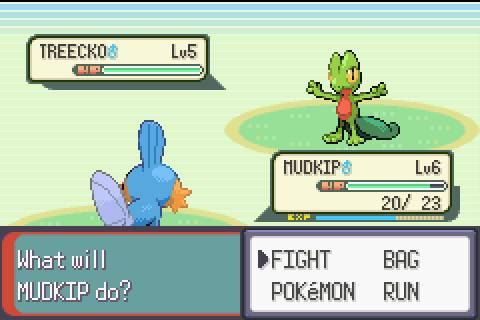
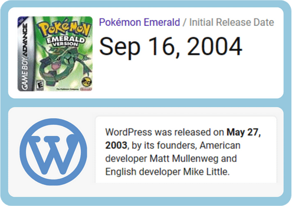
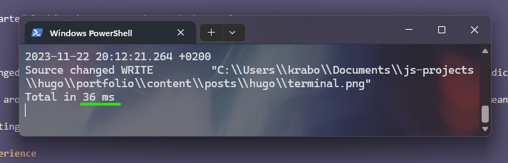
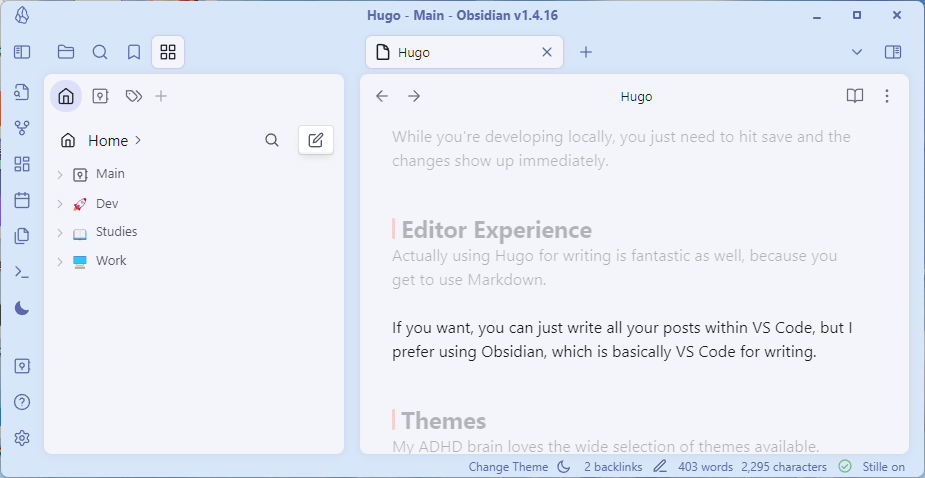
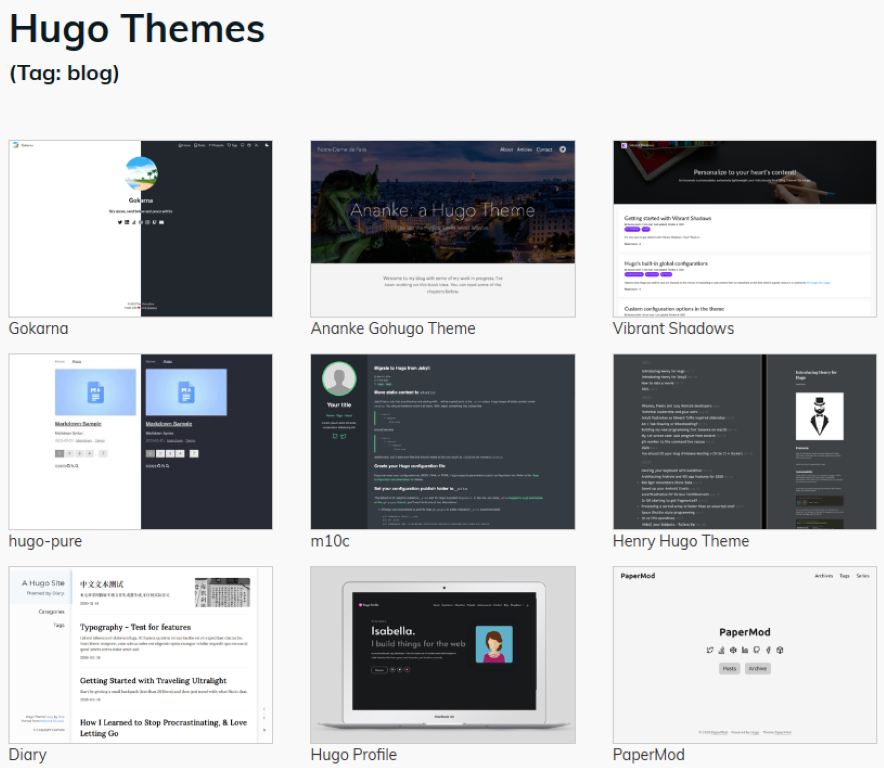

+++
title = 'I like Web Dev Now'
date = 2023-11-21T17:24:26+02:00
draft = false
+++
If you're like me, you have fond memories of playing Pokemon Emerald as a kid. I started back in gen 1, but playing Emerald on my GBA SP was probably what solidified my love for these games.



Maybe you were born too late to experience it on a Game Boy, but I'm pretty sure we've all played it on some kind of emulator.

Here's why I bring this up:

**WordPress is older than Emerald.**


Not by a little either - almost an entire year and a half.



It blows my mind that people still use this ancient platform to make websites.

1. **It uses PHP**
2. **It's extremely slow**
3. **It's super clunky**

Even stuff as simple as custom CSS and Javascript requires you to navigate through multiple pages rather than just going through your text files. Disgusting.

This is why I started looking into more modern web dev tools.

## Hugo

The one that changed everything for me was Hugo. That's what I used to build this site, and why it's so ridiculously fast.

Seriously, click around and check out some of the other pages and then come back here, you'll see what I mean.

With Hugo generating static pages, it's able to build whole sites in *less than 1 second*.



## Developer Experience

It doesn't take super long to figure out how it works, and there's a lot of great tutorials around.

The file structure makes sense, and it's really easy to edit what you need to.

While you're developing locally, you just need to hit save and the changes show up immediately.

## Editor Experience

Actually using Hugo for writing is fantastic as well, because you get to use Markdown.

If you want, you can just write all your posts within VS Code, but I prefer using Obsidian, which is basically VS Code for writing.



In a separate post, I'll go over some of my favourite plugins that make Obsidian such a great app to write with.

## Themes

My ADHD brain loves the wide selection of themes available.

Blogs, documentation sites, portfolios - whatever you're building, there are tons of options to choose from, and each one of those is fully customizable as well.



## So Hugo's the best?

Hugo started me down the rabbit hole of alternative web web dev frameworks and platforms. There's far more to it than what I've mentioned here, but even just these things made web dev so much more interesting for me.

That being said, it's no longer my go-to web framework. There are others I'll discuss in the future, but for now all I'll say is you should definitely try Hugo.

### Windows

```shell
choco install hugo-extended
```
